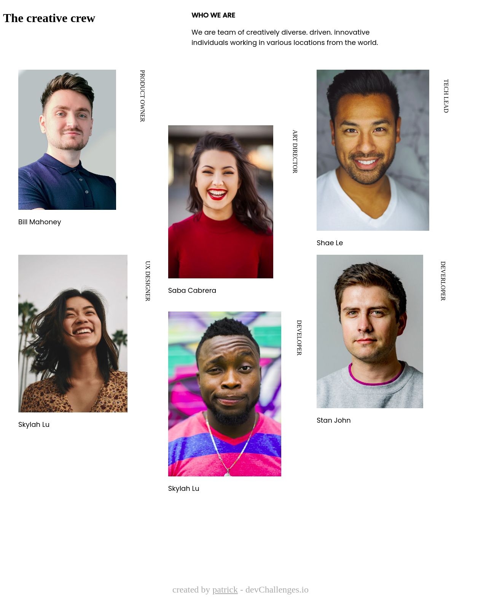

<!-- Please update value in the {}  -->

<h1 align="center">{my-team-page}</h1>

   Solution for a challenge from  <a href="http://devchallenges.io" target="_blank">Devchallenges.io</a>.

  <h3>
    <a href="https://dev-path.github.io/my-team-page/">
      Demo
    </a>
     | 
    <a href="https://github.com/Dev-Path/my-team-page">
      Solution
    </a>
     | 
    <a href="https://devchallenges.io/challenges/hhmesazsqgKXrTkYkt0U">
      Challenge
    </a>
  </h3>

<!-- TABLE OF CONTENTS -->

## Table of Contents

- [Overview](#overview)
  - [Built With](#built-with)
- [Features](#features)
- [Contact](#contact)
- [Acknowledgements](#acknowledgements)

<!-- OVERVIEW -->

## Overview

A contact page that contains team members and their roles.

- I learned how to take a design file and code it following specifications
- How research for information on the to help you solve a particular problem
- How to get going is to continue practising with projects
- How to use css grid to create a responsive page for 3 different screens

### Built With

<!-- This section should list any major frameworks that you built your project using. Here are a few examples.-->

- [HTML 5](https://www.w3schools.com/html/default.asp)
- [CSS 3](https://www.w3schools.com/css/default.asp)

## Features

<!-- List the features of your application or follow the template. Don't share the figma file here :) -->

This application/site was created as a submission to a [DevChallenges](https://devchallenges.io/challenges) challenge. The [challenge](https://devchallenges.io/challenges/hhmesazsqgKXrTkYkt0U) was to build an application to complete the given user stories.

## Acknowledgements

<!-- This section should list any articles or add-ons/plugins that helps you to complete the project. This is optional but it will help you in the future. For exmpale -->

- [Steps to replicate a design with only HTML and CSS](https://devchallenges-blogs.web.app/how-to-replicate-design/)
- [Marked - a markdown parser](https://github.com/chjj/marked)
- [My Reference Site](https://dev-path.github.io/jekyll-theme-memoirs/responsive-design/)

## Contact

- Website [patrick](https://patrickkyei.com)
- GitHub [PatrickKyei](https://github.com/PatrickKyei)
- Twitter [_patrickbaffour](https://twitter.com/_patrickbaffour)
